# Jarkom-Modul-1-IT11-2024

## Kelompok IT11
| NRP | Nama |
| ------ | ------ |
| 5027211049 | Tridiktya Hardani Putra |
| 5027221008 | Jeany Aurellia Putri Dewati |

## Daftar Isi
- [Jarkom-Modul-1-IT11-2024](#jarkom-modul-1-it11-2024)
  - [Kelompok IT11](#kelompok-it11)
  - [Daftar Isi](#daftar-isi)
  - [Creds](#creds)
  - [ATM or ATP or FTP ?🤔](#atm-or-atp-or-ftp-)
  - [Fuzz](#fuzz)
  - [How Many Packets?](#how-many-packets)
  - [Trace Him](#trace-him)
  - [Malwleowleo](#malwleowleo)
  - [Evidence](#evidence)
  - [Whoami](#whoami)
  - [Secret](#secret)

## Creds
Pertama-tama, kami membuka file evidence.pcap dengan Wireshark. Kemudian, memasukkan **ftp** sebagai keyword pada display filter.

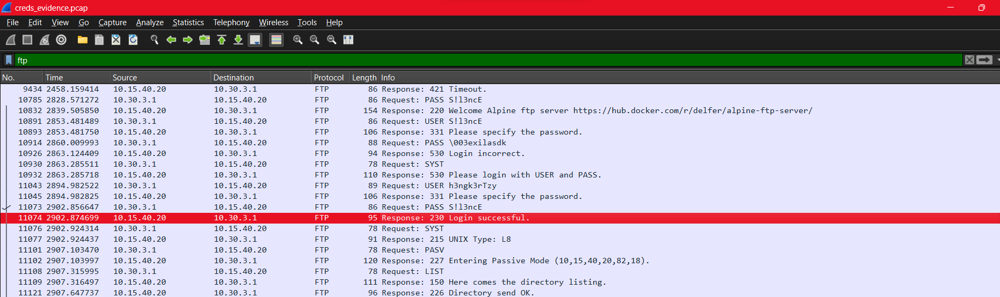
Kami scroll ke bawah sampai menemukan response “Login successful”. Sebenarnya menggunakan filter **ftp.response.code == 230** merupakan cara yang lebih tepat dan cepat untuk menemukan respons login successful karena 230 response code dalam FTP artinya login berhasil. Setelah itu, kami follow TCP Stream dari packet yang mengandung info tersebut.

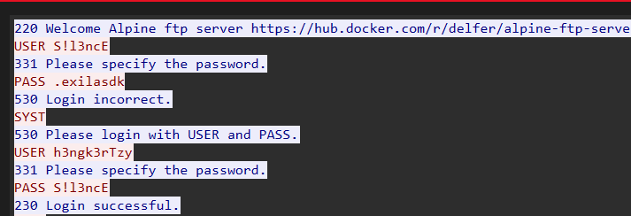

Dan ditemukan USER dan PASS yang digunakan untuk menjawab pertanyaan yang ada pada netcat 10.15.40.20 10007.

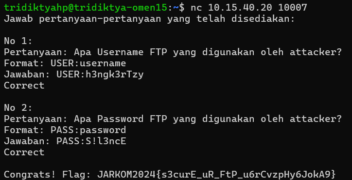
## ATM or ATP or FTP ?🤔
Langkah-langkah penyelesaian soal ini sangat mirip dengan solusi soal “creds”. Pertama-tama, kami membuka file evidence.pcap dengan Wireshark. Kemudian, memasukkan “ftp” sebagai keyword pada display filter.

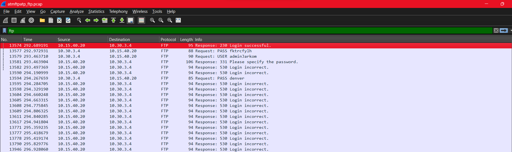

Kami scroll sampai bawah sendiri, dan menemukan response “Login successfull”. Atau dengan cara yang lebih cepat dengan display filter yang digunakan untuk menyelesaikan soal [Creds](#creds). Setelah itu, kami follow TCP Stream.

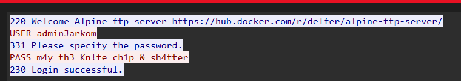

Dan ditemukan PASS yang digunakan untuk menjawab pertanyaan yang ada pada netcat 10.15.40.20 10004.

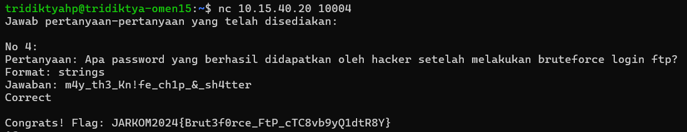
## Fuzz
Pertama-tama, kami membuka file capture.pcap dengan Wireshark. Kemudian, memasukkan “http” sebagai keyword pada display filter.

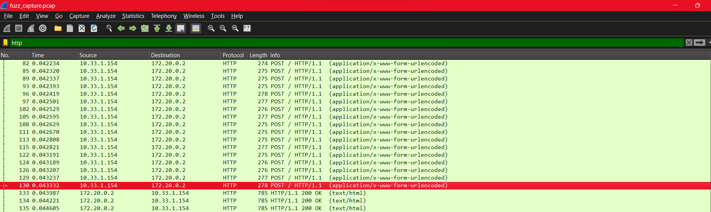

Kami menemukan kumpulan requests di bagian yang paling atas, diketahui dari **Request Header POST / HTTP/1.1 dan application/x-www-form-urlencoded**. IP Source request tersebut merupakan jawaban untuk soal 1 pada netcat. Untuk jawaban soal 2, diketahui dari port **HTTP by default, yaitu 80**. Untuk jawaban soal 3, diketahui dari endpoint yang tertera pada request **(‘/’)**.

Untuk jawaban soal 4, diketahui dari follow HTTP Stream salah satu dari requests tersebut, tetapi berupa singkatan dari software tertera, yaitu **ffuf**.

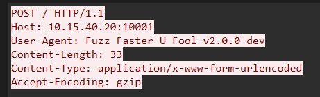

Terakhir, jawaban soal 5, diketahui dengan cara memasukkan keywords **“ip.src == 172.20.0.2 && http”** supaya hasil menunjukkan response dari host (172.20.0.2) dan ber-protokol HTTP.

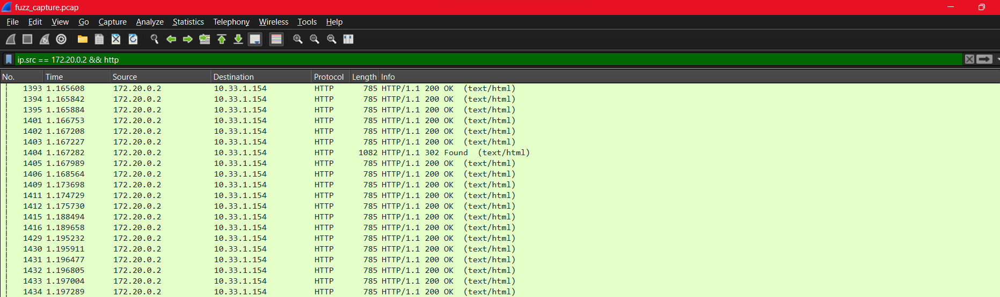

Kami scroll sampai menemukan response yang paling berbeda di antara semuanya. Dan kami menemukan **HTTP Response 302 Found**. Kemudian, kami follow HTTP stream dari response tersebut.

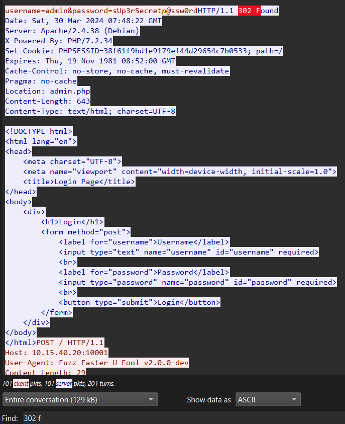

Di dalam stream ini, kami melakukan pencarian spesifik (Find) dengan keyword **“302 f”** untuk menemukan HTTP Response 302 Found guna mengetahui kredensial yang benar, sebagai jawaban dari soal 5.

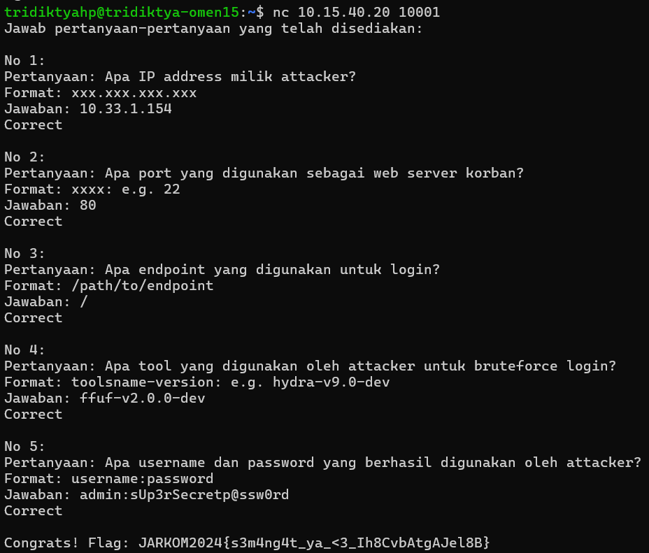
## How Many Packets?
Pada filter dimasukkan keyword **ftp.response.code == 331** untuk melakukan list semua response yang membutuhkan password untuk melanjutkan code 331. Dan didapatkan terdapat **934** packet yang muncul dari hasil response.

Hasil ini kemudian kami masukkan pada nc yang ada pada soal dan didapatkan flag sebagai berikut.

## Trace Him
Kami mendapatkan ip attacker dengan melihat kolom destination pada bagian response. Didapatkan IP address attacker yaitu **10.15.40.20**.

Hasil ini kemudian kami masukkan pada nc dan didapatkan flag sebagai berikut.

## Malwleowleo
Pertama kami melakukan filter **tcp.stream eq (nomor)** dan kemudian melakukan follow. Ketika mencapai **tcp.stream eq 2 kami** menemukan command **STOR m4L1c10us_W4re.c**.

Kemudian file **m4L1c10us_W4re.c** kami masukkan pada nc dan didapatkan flag sebagai berikut.

## Evidence
Kami mendapatkan domain dari korban dengan melakukan filter dengan keyword **http**, kemudian setelah melakukan scroll, pada **tcp.stream eq 1011** didapatkan domain korban yaitu **nanomate-solution.com**

Pertanyaan selanjutnya dari nc adalah web server dari korban. Setelah menemukan domain korban, kemudian kami mencoba melakukan filter menggunakan keyword **http.host = “nanomate-solutions.com”**. Setelah itu kami menemukan pada **tcp.stream eq 1026** web server dari korban beserta versinya yaitu **Apache/2.4.56**.

Pertanyaan selanjutnya adalah mencari endpoint. Untuk mencarinya kami melakukan filter dengan keyword **http.request.method** dan setelah dilakukan scroll kami mendapatkan **/app/includes/process_login.php** sebagai hasilnya.

Pertanyaan terakhir yaitu email dan password yang dapat melakukan login. Kami melakukan filter keyword **http** kemudian kami cari info yang memiliki metode post dan hasil yang bertuliskan "Login Succesful". Kemudian didapatkan **email=tareq@gmail.com&password=tareq@nanomate**.

Semua jawaban ini, kami masukkan pada nc dan didapatkan hasil flag seperti berikut.

## Whoami
Kami menemukan nama dari attacker setelah melakukan filter **tcp.stream(nomor)** dan menemukannya pada **tcp.stream eq 7**, tapi masih terenkripsi

Setelah itu kami melakukan decode menggunakan base64 dan didapatkan nama dari attacker yaitu **Paul Atreides**.

Dan kemudian kami masukkan nama tersebut pada nc dan didapatkan hasil flag seperti berikut.

## Secret
Kami menemukan pesan tersembunyi dari attacker dengan melakukan **export object**.

Didapatkan 2 file seperti berikut.

Kemudian kami save file yang bertuliskan **mirza.jpg** dan didapatkan gambar yang berisi pesan seperti dibawah ini. 

Kata **MIO MIRZA** kami inputkan pada nc dan didapatkan hasil flag seperti berikut ini.

